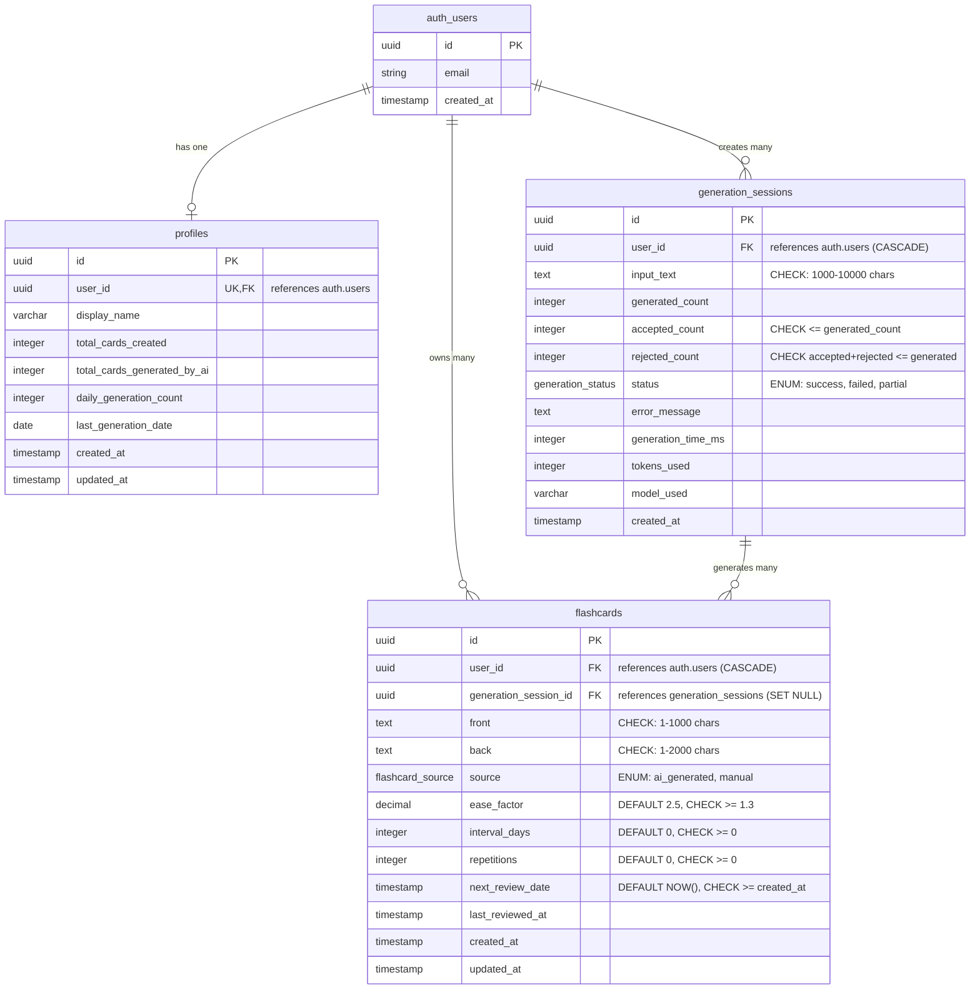

# Schemat bazy danych - 10x-cards

## Przegląd

Schemat bazy danych dla MVP aplikacji 10x-cards został zaprojektowany z naciskiem na:
- **Bezpieczeństwo**: Row Level Security (RLS) na wszystkich tabelach
- **Skalowalność**: Optymalne indeksy i struktura danych
- **Integralność**: Foreign keys z CASCADE, constraints i triggers
- **Wydajność**: Algorytm SM-2 dla spaced repetition
- **Audytowalność**: Immutable audit log dla sesji generowania

## Diagram ERD (Entity Relationship Diagram)



## Tabele

### 1. profiles

**Opis**: Rozszerza tabelę `auth.users` o dodatkowe dane użytkownika, statystyki i preferencje.

**Kolumny**:
- `id` (UUID, PK): Unikalny identyfikator profilu
- `user_id` (UUID, UK, FK → auth.users): Powiązanie z kontem użytkownika
- `display_name` (VARCHAR(100)): Nazwa wyświetlana użytkownika
- `total_cards_created` (INTEGER, DEFAULT 0): Liczba wszystkich utworzonych fiszek
- `total_cards_generated_by_ai` (INTEGER, DEFAULT 0): Liczba fiszek wygenerowanych przez AI
- `daily_generation_count` (INTEGER, DEFAULT 0): Liczba sesji generowania dzisiaj (rate limiting)
- `last_generation_date` (DATE): Data ostatniej sesji generowania
- `created_at` (TIMESTAMP WITH TIME ZONE): Data utworzenia profilu
- `updated_at` (TIMESTAMP WITH TIME ZONE): Data ostatniej aktualizacji

**RLS Policies**:
- SELECT: Użytkownik może widzieć tylko własny profil
- UPDATE: Użytkownik może aktualizować tylko własny profil
- INSERT: Auto-utworzenie przez trigger przy rejestracji

**Triggers**:
- Auto-update `updated_at` przy UPDATE
- Auto-create profile przy tworzeniu nowego użytkownika w `auth.users`

---

### 2. flashcards

**Opis**: Przechowuje fiszki użytkowników z metadanymi algorytmu spaced repetition (SM-2).

**Kolumny**:
- `id` (UUID, PK): Unikalny identyfikator fiszki
- `user_id` (UUID, FK → auth.users, CASCADE): Właściciel fiszki
- `generation_session_id` (UUID, FK → generation_sessions, SET NULL): Link do sesji generowania (NULL dla fiszek manualnych)
- `front` (TEXT): Przód fiszki (pytanie) - 1-1000 znaków
- `back` (TEXT): Tył fiszki (odpowiedź) - 1-2000 znaków
- `source` (ENUM: flashcard_source): Źródło: 'ai_generated' lub 'manual'
- `ease_factor` (DECIMAL, DEFAULT 2.5): Współczynnik łatwości SM-2 (min 1.3)
- `interval_days` (INTEGER, DEFAULT 0): Liczba dni do następnej powtórki
- `repetitions` (INTEGER, DEFAULT 0): Liczba udanych powtórek
- `next_review_date` (TIMESTAMP, DEFAULT NOW()): Data następnej powtórki
- `last_reviewed_at` (TIMESTAMP): Data ostatniej powtórki
- `created_at` (TIMESTAMP WITH TIME ZONE): Data utworzenia
- `updated_at` (TIMESTAMP WITH TIME ZONE): Data ostatniej aktualizacji

**Constraints**:
- CHECK: `LENGTH(front) > 0 AND LENGTH(front) <= 1000`
- CHECK: `LENGTH(back) > 0 AND LENGTH(back) <= 2000`
- CHECK: `ease_factor >= 1.3`
- CHECK: `interval_days >= 0`
- CHECK: `repetitions >= 0`
- CHECK: `next_review_date >= created_at`

**RLS Policies**:
- SELECT/INSERT/UPDATE/DELETE: Użytkownik może zarządzać tylko własnymi fiszkami

**Triggers**:
- Auto-update `updated_at` przy UPDATE
- Update statystyk w `profiles` przy INSERT/DELETE
- Update statystyk w `profiles` przy zmianie `source`

**Indeksy**:
- `idx_flashcards_user_id` ON (user_id)
- `idx_flashcards_next_review_date` ON (next_review_date, user_id)
- `idx_flashcards_created_at` ON (user_id, created_at DESC)
- `idx_flashcards_source` ON (user_id, source)
- `idx_flashcards_due_review` (partial) ON (user_id, next_review_date) WHERE next_review_date <= NOW()

---

### 3. generation_sessions

**Opis**: Immutable audit log sesji generowania fiszek przez AI. Służy do analizy metryk sukcesu.

**Kolumny**:
- `id` (UUID, PK): Unikalny identyfikator sesji
- `user_id` (UUID, FK → auth.users, CASCADE): Użytkownik inicjujący generowanie
- `input_text` (TEXT): Tekst wejściowy (1000-10000 znaków)
- `generated_count` (INTEGER): Liczba wygenerowanych fiszek
- `accepted_count` (INTEGER, DEFAULT 0): Liczba zaakceptowanych fiszek
- `rejected_count` (INTEGER, DEFAULT 0): Liczba odrzuconych fiszek
- `status` (ENUM: generation_status): Status: 'success', 'failed', 'partial'
- `error_message` (TEXT): Opis błędu (jeśli wystąpił)
- `generation_time_ms` (INTEGER): Czas odpowiedzi API w ms
- `tokens_used` (INTEGER): Liczba tokenów użyta przez LLM
- `model_used` (VARCHAR(100)): Identyfikator użytego modelu
- `created_at` (TIMESTAMP WITH TIME ZONE): Data utworzenia sesji

**Constraints**:
- CHECK: `LENGTH(input_text) >= 1000 AND LENGTH(input_text) <= 10000`
- CHECK: `accepted_count <= generated_count`
- CHECK: `accepted_count + rejected_count <= generated_count`

**RLS Policies**:
- SELECT: Użytkownik może widzieć tylko własne sesje
- INSERT: Użytkownik może tworzyć tylko własne sesje
- UPDATE/DELETE: BLOCKED (immutable audit log)

**Indeksy**:
- `idx_generation_sessions_user_id` ON (user_id, created_at DESC)
- `idx_generation_sessions_input_text` (GIN) ON to_tsvector('english', input_text)

---

## Typy ENUM

### flashcard_source
Źródło powstania fiszki:
- `ai_generated`: Wygenerowana przez AI
- `manual`: Utworzona ręcznie przez użytkownika

### generation_status
Status sesji generowania:
- `success`: Wszystkie fiszki wygenerowane poprawnie
- `failed`: Błąd API/timeout
- `partial`: Część fiszek wygenerowana (niepełna odpowiedź)

---

## Funkcje

### 1. update_card_review(card_uuid UUID, quality INTEGER)

**Opis**: Aktualizuje parametry fiszki zgodnie z algorytmem SM-2 po powtórce.

**Parametry**:
- `card_uuid`: UUID fiszki do aktualizacji
- `quality`: Ocena powtórki (0-5, gdzie 0=całkowite zapomnienie, 5=idealna pamięć)

**Zwraca**: Zaktualizowany rekord fiszki

**Logika**:
- Walidacja: `quality` musi być w zakresie 0-5
- Jeśli `quality >= 3`: zwiększ `repetitions`, oblicz nowy `interval_days` i `ease_factor`
- Jeśli `quality < 3`: zresetuj `repetitions` do 0, `interval_days` do 1
- Formuła ease_factor: `ease_factor + (0.1 - (5-quality) * (0.08 + (5-quality) * 0.02))`
- Minimum `ease_factor = 1.3`

**Security**: SECURITY INVOKER (respektuje RLS)

---

### 2. get_cards_due_for_review(user_uuid UUID, limit_count INTEGER)

**Opis**: Zwraca fiszki gotowe do powtórki dla użytkownika.

**Parametry**:
- `user_uuid`: UUID użytkownika
- `limit_count`: Maksymalna liczba fiszek (domyślnie 20)

**Zwraca**: Tabela fiszek gotowych do powtórki

**Logika**:
- Filtruje fiszki gdzie `next_review_date <= NOW()`
- Sortuje po `next_review_date ASC` (najpierw zaległe), następnie losowo
- Limituje wyniki

**Security**: SECURITY INVOKER (respektuje RLS)

---

### 3. get_user_stats(user_uuid UUID)

**Opis**: Zwraca kompleksowe statystyki użytkownika.

**Parametry**:
- `user_uuid`: UUID użytkownika

**Zwraca**: JSON z następującymi polami:
- `total_cards_created`: Łączna liczba utworzonych fiszek
- `total_cards_generated_by_ai`: Liczba fiszek wygenerowanych przez AI
- `cards_due_today`: Liczba fiszek do powtórki dzisiaj
- `total_reviews_completed`: Liczba fiszek przynajmniej raz powtórzonych
- `total_generation_sessions`: Liczba sesji generowania
- `total_accepted_cards`: Suma zaakceptowanych fiszek ze wszystkich sesji
- `average_acceptance_rate`: Średni procent akceptacji (%)
- `daily_generation_count`: Liczba sesji generowania dzisiaj
- `last_generation_date`: Data ostatniej sesji

**Security**: SECURITY INVOKER (respektuje RLS)

---

### 4. Funkcje pomocnicze (Triggers)

#### update_updated_at_column()
Auto-aktualizacja kolumny `updated_at` przy UPDATE.

#### handle_new_user()
Auto-tworzenie profilu w `profiles` przy rejestracji użytkownika w `auth.users`.

#### update_profile_stats()
Aktualizacja statystyk w `profiles` przy INSERT/DELETE fiszki.

#### update_profile_stats_on_source_change()
Aktualizacja statystyk w `profiles` przy zmianie `source` fiszki.

---

## Row Level Security (RLS)

Wszystkie tabele mają włączony RLS. Polityki zapewniają:

1. **Izolacja danych**: Użytkownik widzi tylko swoje dane
2. **Bezpieczeństwo**: Brak dostępu do danych innych użytkowników
3. **RODO compliance**: CASCADE DELETE przy usunięciu konta
4. **Audit integrity**: Blokada UPDATE/DELETE na `generation_sessions`

### Przykładowe polityki:

```sql
-- Profiles
CREATE POLICY "Users can view own profile" 
    ON profiles FOR SELECT 
    USING (user_id = auth.uid());

-- Flashcards
CREATE POLICY "Users can view own flashcards" 
    ON flashcards FOR SELECT 
    USING (user_id = auth.uid());

-- Generation Sessions (immutable)
CREATE POLICY "Users cannot update sessions" 
    ON generation_sessions FOR UPDATE 
    USING (false);
```

---

## Indeksy i optymalizacja

### Strategia indeksowania:

1. **Primary queries**: Indeksy na `user_id` dla wszystkich tabel
2. **Review queries**: Composite index na `(user_id, next_review_date)`
3. **List queries**: Composite index na `(user_id, created_at DESC)`
4. **Analytics queries**: Partial index dla fiszek zaległych
5. **Full-text search**: GIN index na `input_text` (opcjonalnie)

### Partial indexes:

```sql
CREATE INDEX idx_flashcards_due_review 
    ON flashcards(user_id, next_review_date) 
    WHERE next_review_date <= NOW();
```

Zmniejsza rozmiar indeksu, przyspieszając zapytania o fiszki do powtórki.

---

## Algorytm SM-2 (Spaced Repetition)

Implementacja klasycznego algorytmu SuperMemo-2:

### Parametry:
- **ease_factor**: Współczynnik łatwości (min 1.3, start 2.5)
- **interval_days**: Liczba dni do następnej powtórki
- **repetitions**: Liczba udanych powtórek

### Logika:

```
IF quality >= 3 (correct response):
    repetitions += 1
    
    IF repetitions == 1:
        interval_days = 1
    ELSE IF repetitions == 2:
        interval_days = 6
    ELSE:
        interval_days = interval_days * ease_factor
    
    ease_factor = ease_factor + (0.1 - (5-quality) * (0.08 + (5-quality) * 0.02))
    ease_factor = max(ease_factor, 1.3)
    
ELSE (incorrect response):
    repetitions = 0
    interval_days = 1
    ease_factor = unchanged
```

### Quality scale:
- 0: Całkowite zapomnienie
- 1: Nieprawidłowa odpowiedź, ale rozpoznanie
- 2: Nieprawidłowa odpowiedź, łatwe przypomnienie
- 3: Prawidłowa odpowiedź z trudnością
- 4: Prawidłowa odpowiedź po wahaniu
- 5: Idealna odpowiedź

---

## Rate Limiting

Proste ograniczenie liczby sesji generowania AI:

- **Kolumny**: `daily_generation_count`, `last_generation_date` w `profiles`
- **Limit**: Maksymalnie N sesji dziennie (np. 10)
- **Reset**: Automatyczny przy zmianie daty
- **Cel**: Kontrola kosztów API, ochrona przed nadużyciami

---

## Metryki sukcesu

Schemat wspiera śledzenie metryk z PRD:

### 1. Akceptacja AI (cel: 75%)
```sql
SELECT 
    ROUND((SUM(accepted_count)::DECIMAL / SUM(generated_count)::DECIMAL) * 100, 2) 
        AS acceptance_rate
FROM generation_sessions 
WHERE status = 'success';
```

### 2. Użycie AI vs Manual (cel: 75% AI)
```sql
SELECT 
    COUNT(*) FILTER (WHERE source = 'ai_generated')::DECIMAL / COUNT(*)::DECIMAL * 100 
        AS ai_usage_percentage
FROM flashcards;
```

### 3. Zaangażowanie użytkowników
```sql
SELECT 
    COUNT(DISTINCT user_id) AS active_users,
    AVG(total_cards_created) AS avg_cards_per_user,
    AVG(daily_generation_count) AS avg_daily_generations
FROM profiles;
```

---

## Migracje

### Uruchomienie migracji:

1. **Przez Supabase CLI**:
```bash
supabase db push
```

2. **Przez Supabase Dashboard**:
- SQL Editor → Nowa query → Wklej zawartość `001_init_schema.sql` → Run

### Seed data (tylko dev/staging):
```bash
psql -d your_database < supabase/migrations/002_seed_data.sql
```

**UWAGA**: Przed uruchomieniem seed data, zaktualizuj UUID użytkownika testowego!

---

## Bezpieczeństwo

### CASCADE DELETE (RODO compliance):
- Usunięcie konta w `auth.users` → automatyczne usunięcie wszystkich powiązanych danych
- `profiles` → CASCADE
- `flashcards` → CASCADE
- `generation_sessions` → CASCADE

### Immutable audit log:
- `generation_sessions` nie może być modyfikowana ani usuwana przez użytkowników
- Tylko INSERT i SELECT
- Usunięcie tylko przez CASCADE przy usunięciu konta

### Data integrity:
- CHECK constraints zapobiegają nieprawidłowym danom
- Foreign keys zapewniają spójność relacji
- Triggers automatyzują aktualizacje

---

## Przyszłe rozszerzenia (poza MVP)

Potencjalne rozszerzenia schematu w przyszłości:

1. **Decks/Collections**: Grupowanie fiszek w zestawy
2. **Tags**: System tagów dla fiszek
3. **Shared decks**: Współdzielenie fiszek między użytkownikami
4. **Card history**: Wersjonowanie edytowanych fiszek
5. **Advanced stats**: Szczegółowe statystyki nauki
6. **Gamification**: Punkty, streaki, osiągnięcia
7. **Import/Export**: PDF, Anki, CSV
8. **Soft delete**: Kosz na usunięte fiszki

---

## Autorzy

Schemat bazy danych został zaprojektowany dla projektu 10x-cards MVP.

Data utworzenia: 2025-10-25
Wersja: 1.0.0

